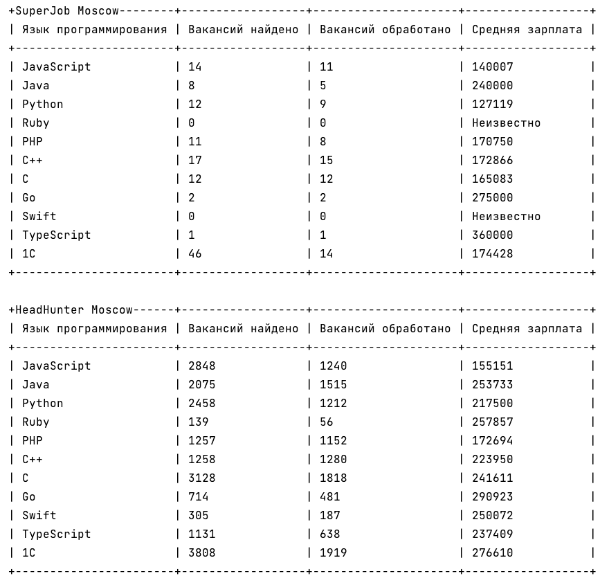

# Programming vacancies compare
This project uses job search services APIs 
to determine average salaries for programmers by different programming languages
in Moscow region.
The project supports two job search engines - HeadHunter (hh) and SuperJob (sj).
The main file to execute the project is **get_salaries.py**.

## Setup
1. Clone the repository to your local machine.
2. Create virtual environment to the project:
```
python -m venv env
```
3. Activate the virtual environment:

for Windows:
```
.\env\Scripts\activate
```
for Linux or macOS:
```
source env/bin/activate
```
4. Install the requirements: ```pip install -r requirements.txt```

5. Set environment variables in a file named .env. Create it in the root directory of the project and add your telegram bot API token and chat ID as well as NASA API token as follows:
```
SUPERJOB_KEY=<your_superjob_key>
```
Please, visit the following [website](https://api.superjob.ru/) to get SuperJob Secret key.

## Usage
This code provides an analysis of average salaries for various programming languages in Moscow, Russia. 
It does this by fetching job vacancies from two job search services, HeadHunter and SuperJob,
and then predicting salaries based on the salary information provided in the vacancies. 
The output is presented in the form of an ASCII table for each service with the following columns:

1. **Programming Language:** The name of the programming language.
2. **Vacancies Found:** The number of job vacancies found for that language.
3. **Vacancies Processed:** The number of job vacancies processed (i.e., for which salary predictions were made).
4. **Average Salary:** The average predicted salary for the vacancies processed.

To run the code, simply execute get_salaries.py file.
```
python get_salaries.py
```
The code will fetch vacancies from the HeadHunter and SuperJob APIs, 
predict salaries for those vacancies, and display the results in an ASCII table.

You can **change the list of languages** you want to compare information of in the
main() function in the get_salaries.py file.

## Example output
After running the code you will get two tables that look like the following:



## Contributing
If you have suggestions for how this code could be improved, 
please contact me via n.a.kashaeva@gmail.com.

## License
This project is licensed under the MIT License - see the LICENSE file for details.